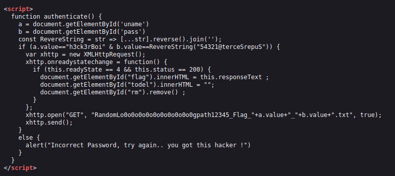

# 🚩 CyberHeroes CTF - Həll Yolu (Write-up)

Bu sənəddə **CyberHeroes** CTF tapşırığının tam analizi, istifadə olunan metodologiya və əldə olunan nəticə təsvir edilmişdir.

---

## 📋 Tapşırıq Haqqında
* **Məqsəd:** Giriş panelini bypass etmək və gizli bayrağı əldə etmək.
* **Kateqoriya:** Veb Təhlükəsizliyi / JavaScript Analizi.
* **Çətinlik:** Başlanğıc.

---

## 🛠️ Addım-Addım Həll Proseduru

### 1. Veb İnterfeysinin Tədqiqi
Tapşırığa başladıqda bizi "CyberHeros" adlı ana səhifə qarşılayır. Sol tərəfdəki naviqasiya menyusunda **Login** bölməsi diqqəti cəlb edir.

### 2. Müştəri Tərəfli (Client-Side) Kodun Analizi
Giriş səhifəsinin mənbə koduna baxdıqda, daxil edilən məlumatların necə yoxlandığını göstərən JavaScript funksiyasını görürük.

Kodun analizi nəticəsində aşağıdakı məlumatlar aşkarlanmışdır:
* **İstifadəçi Adı (`uname`):** Kodda sabit olaraq `h3ck3rBoi` olaraq təyin edilib.
* **Parolun Çevrilmə Mexanizmi:** `RevereString` funksiyası daxil edilən mətni tərsinə çevirir.
* **Parolun Yoxlanılması:** Proqram təminatı daxil edilən parolu `RevereString("54321@terceSrepuS")` nəticəsi ilə müqayisə edir.

### 3. Tərs Mühəndislik (Reverse Engineering)
Giriş əldə etmək üçün kodun daxilindəki gizli simvollar ardıcıllığını tərsinə çeviririk:

**Mənbə:** `54321@terceSrepuS`  
**Nəticə (Həqiqi Parol):** `SuperSecret@12345`

### 4. Bayrağın (Flag) Əldə Edilməsi
Tapılmış etibarnamələri (credentials) istifadə edərək giriş etdikdə, sistem uğurla avtorizasiya olunur və bayraq ekranda göstərilir.

---

## 🏁 Yekun Nəticə

Sistemə uğurlu girişdən sonra əldə edilən bayraq:

> **FLAG:** `flag{...}` 
> *(Qeyd: Bayrağın tam mətni təhlükəsizlik və tapşırığın məxfiliyi səbəbindən burada açıq yazılmamışdır)*

---

## 💡 Təhlükəsizlik Nəticələri
Bu tapşırıq göstərir ki, **autentifikasiya məntiqi heç vaxt müştəri tərəfində (JavaScript) saxlanılmamalıdır**. Bütün doğrulama prosesləri server tərəfində (backend) təhlükəsiz şəkildə həyata keçirilməlidir.
